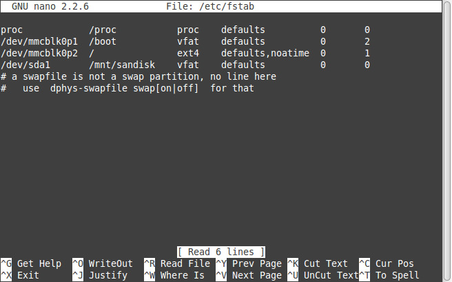

# Raspberry Pi Network Attached Storage (NAS)

Setup a simple NAS for home. There are numerous references around the web (which I linked to for reference), I am just trying to document my setup. A good general reference is:

- [alexellis.io](http://blog.alexellis.io/hardened-raspberry-pi-nas/)

**Still Work in Progress**

- Need to add an external hard drive, I have done this before, but last time the drive died on me because (I think) it *never* spun down. So I want to select a drive that can be modified with something like `hdparam`

## Rasbian

I am using Raspbian Jessie Lite (2017-01-11) as the base. Once setup, do (this took a while for me):

	sudo apt update
	sudo apt upgrade

**Note** I am using the newer package manager `apt` instead of the older ones `apt-get` and `apt-cache`. Now get tools to upgrade the kernel (raspbian always has an old kernel).

	sudo apt install rpi-update
	sudo rpi-update

Now your kernel and software should be good to go.

### Customization

`raspi-config`:

- host name
- resize the your micro SD card
- change the GPU/memory split
- correct time zone
- set local to `en_US.UTF-8 UTF-8` (default is en_GB because rpi was made in the UK)

When you login via `ssh` you get a bunch of licensing garbage. You can change the message of the day (motd) by editing `/etc/motd` to something else ... I like ascii art!

	nina@Dalek ~ $ ssh pi@raspberrypi.local
	pi@raspberrypi.local's password: 

				  a8888b.   
				 d888888b. 
				 8P"YP"Y88 
				 8|o||o|88 
				 8'    .88 
				 8`._.' Y8. 
				d/      `8b. 
			   dP   .    Y8b. 
			  d8:'  "  `::88b 
			 d8"         'Y88b 
			:8P    '      :888 
			 8a.   :     _a88P 
		   ._/"Yaa_:   .| 88P| 
		   \    YP"    `| 8P  `.
		   /     \.___.d|    .' 
		   `--..__)8888P`._.' 
	Last login: Sat Feb 18 20:12:10 2017 from fe80::14f5:a870:7365:b0e1%eth0
	pi@raspberrypi:~ $ 

### Software

Other useful software can be installed with `sudo apt install <package>`:

- build-essential
- cmake
- nmap
- python-dev
- htop

[kernel ref](http://walchko.github.io/posts/2014/10/linux-kernel/)

## Static IP Address

Since this is a server, I don't want the IP address to change. I also use a wired interface, but I also show a wifi example below:

	[kevin@raspberrypi ~]$ more /etc/network/interfaces
	auto lo
	iface lo inet loopback

	# dynamic interface
	#iface eth0 inet dhcp

	# static interface
	iface eth0 inet static
	  address 192.168.1.112
	  netmask 255.255.255.0
	  gateway 192.168.1.1

	auto wlan0
	iface wlan0 inet static
	  address 192.168.1.111
	  wpa-conf /etc/wpa_supplicant/wpa_supplicant.conf
	  netmask 255.255.255.0
	  gateway 192.168.1.1

## Node.js

Node is historically old on debian servers, so let's get updates from the source.

	curl -sL https://deb.nodesource.com/setup_7.x | sudo -E bash -
	sudo apt-get install -y nodejs

This will install it to `/usr/lib` instead of `/usr/local` unfortunately.

[node docs](https://nodejs.org/en/download/package-manager/#debian-and-ubuntu-based-linux-distributions)

### NPM

Other useful npms can be installed with `sudo npm install -g <package>`:

- httpserver
- archeyjs

[node ref](http://walchko.github.io/posts/2015/09/nodejs/)

## Samba

This is the preferred way to communicate between macOS and linux. First let's install the software:

	sudo apt-get update
	sudo apt-get install samba samba-common-bin

Setup a login for user `pi` (or whatever user you want):

	sudo smbpasswd -a pi

Now let's set it up:

	sudo cp /etc/samba/smb.conf /etc/samba/smb.bak
	sudo pico /etc/samba/smb.conf

Change the config file to look like this:

	#======================= Global Settings =======================

	[global]
	   workgroup = WORKGROUP
	   wins support = yes
	   dns proxy = no

	#### Debugging/Accounting ####
	   log file = /var/log/samba/log.%m
	   max log size = 1000
	   syslog = 0
	   panic action = /usr/share/samba/panic-action %d


	####### Authentication #######

	   server role = standalone server
	   passdb backend = tdbsam
	   obey pam restrictions = yes
	   unix password sync = yes
	   passwd program = /usr/bin/passwd %u
	   passwd chat = *Enter\snew\s*\spassword:* %n\n *Retype\snew\s*\spassword:* %n\n *password\supdated\ssuccessfully* .
	   pam password change = yes
	   map to guest = bad user

	############ Misc ############

	# Allow users who've been granted usershare privileges to create
	# public shares, not just authenticated ones
	   usershare allow guests = yes

	#======================= Share Definitions =======================

	[homes]
	   comment = Home Directories
	   browseable = yes
	   read only = no
	   create mask = 0700
	   directory mask = 0700
	   valid users = %S


## Hard Drive

Setting up the USB drive:

- format it for exFat so it is read/write on both Linux and macOS and supports files >4Gib
	- need to install drivers for it: `sudo apt install exfat-fuse`
- copy over any movies (faster than network)
- use a powered hub, the drive I have pulled enough power to brown out the RPi 3

		pi@nas:/home/plex $ sudo mkdir /media/usb
		pi@nas:/home/plex $ sudo chown -R plex:pi /media/usb
		pi@nas:/home/plex $ sudo chown -R pi:pi /media/usb
		pi@nas:/home/plex $ sudo mount /dev/sda2 /media/usb -o uid=pi,gid=pi
		FUSE exfat 1.1.0
		pi@nas:/home/plex $ sudo chmod 777 -R /media/usb/



Notice how the exfat driver popped up when we mounted the hd. Now setup `/etc/fstab`: `UUID=58A8-E5BE /mnt/PIHDD exfat defaults,auto,user,umask=000,rw,uid=pi,gid=pi 0 0`

- **auto** – The filesystem can be mounted automatically (at bootup, or when mount is passed the -a option). This is really unnecessary as this is the default action of mount -a anyway.
- **rw** – Mount read-write.
- **user** – Permit any user to mount the filesystem. This automatically implies noexec, nosuid,nodev unless overridden.
- **defaults** – Use default settings. Equivalent to rw, suid, dev, exec, auto, nouser, async.
- **umaks** - Sets the default permissions for folders and files. It is the opposite of chmod, so to do a chmod 777, you would issue `umask=000`
- **uid/gid** - Set user and group ids

You can get the UUID by:

	pi@nas:~ $ sudo blkid
	/dev/mmcblk0p1: LABEL="boot" UUID="0F5F-3CD8" TYPE="vfat" PARTUUID="05a2e98f-01"
	/dev/mmcblk0p2: UUID="0aed834e-8c8f-412d-a276-a265dc676112" TYPE="ext4" PARTUUID="05a2e98f-02"
	/dev/mmcblk0: PTUUID="05a2e98f" PTTYPE="dos"
	/dev/sdb1: LABEL="EFI" UUID="3F3C-1AF6" TYPE="vfat" PARTLABEL="EFI System Partition" PARTUUID="0d08e539-26cd-409a-a671-60be8792e7e6"
	/dev/sdb2: LABEL="Nixon" UUID="58A8-E5BE" TYPE="exfat" PARTLABEL="Untitled" PARTUUID="1e6665d5-8724-4e7e-8060-ada89b769224"
	/dev/sdb3: UUID="f10a9273-79d0-3c94-8c3a-b1f98e8bf45a" LABEL="Recovery HD" TYPE="hfsplus" PARTLABEL="Recovery HD" PARTUUID="db64ac2d-3a38-4e8d-abba-ca08d0a5fd49"

- [exfat](https://miqu.me/blog/2015/01/14/tip-exfat-hdd-with-raspberry-pi/)
- [mounting hd](http://www.makeuseof.com/tag/how-to-mount-a-usb-flash-device-in-linux-and-your-raspberry-pi/)
- [mounting hd](https://miqu.me/blog/2015/01/14/tip-exfat-hdd-with-raspberry-pi/)
- [fstab ref](http://www.omaroid.com/fstab-permission-masks-explained/)
- [chmod command ref](https://www.maketecheasier.com/file-permissions-what-does-chmod-777-means/)

### HD Sleep

**not working with my current usb drive**

Let's get some info:

	pi@nas:~ $ sudo hdparm -I /dev/sda

	/dev/sda:

	ATA device, with non-removable media
		Model Number:       WDC WD2500BMVS-11F9S0                   
		Serial Number:      WD-WXE808D77224
		Firmware Revision:  01.01A11
		Transport:          Serial, SATA 1.0a, SATA II Extensions, SATA Rev 2.5
	Standards:
		Supported: 8 7 6 5 
		Likely used: 8
	Configuration:
		Logical		max	current
		cylinders	16383	16383
		heads		16	16
		sectors/track	63	63
		--
		CHS current addressable sectors:   16514064
		LBA    user addressable sectors:  268435455
		LBA48  user addressable sectors:  488397168
		Logical/Physical Sector size:           512 bytes
		device size with M = 1024*1024:      238475 MBytes
		device size with M = 1000*1000:      250059 MBytes (250 GB)
		cache/buffer size  = 8192 KBytes
		Nominal Media Rotation Rate: 5400
	Capabilities:
		LBA, IORDY(can be disabled)
		Queue depth: 32
		Standby timer values: spec'd by Standard, with device specific minimum
		R/W multiple sector transfer: Max = 16	Current = 0
		Advanced power management level: 120
		Recommended acoustic management value: 128, current value: 254
		DMA: mdma0 mdma1 mdma2 udma0 udma1 udma2 udma3 udma4 udma5 *udma6 
		     Cycle time: min=120ns recommended=120ns
		PIO: pio0 pio1 pio2 pio3 pio4 
		     Cycle time: no flow control=120ns  IORDY flow control=120ns
	Commands/features:
		Enabled	Supported:
		   *	SMART feature set
			Security Mode feature set
		   *	Power Management feature set
		   *	Write cache
		   *	Look-ahead
		   *	Host Protected Area feature set
		   *	WRITE_BUFFER command
		   *	READ_BUFFER command
		   *	NOP cmd
		   *	DOWNLOAD_MICROCODE
		   *	Advanced Power Management feature set
			SET_MAX security extension
		   *	Automatic Acoustic Management feature set
		   *	48-bit Address feature set
		   *	Device Configuration Overlay feature set
		   *	Mandatory FLUSH_CACHE
		   *	FLUSH_CACHE_EXT
		   *	SMART error logging
		   *	SMART self-test
		   *	General Purpose Logging feature set
		   *	WRITE_{DMA|MULTIPLE}_FUA_EXT
		   *	64-bit World wide name
		   *	IDLE_IMMEDIATE with UNLOAD
		   *	Segmented DOWNLOAD_MICROCODE
		   *	Gen1 signaling speed (1.5Gb/s)
		   *	Native Command Queueing (NCQ)
		   *	Host-initiated interface power management
		   *	Phy event counters
			DMA Setup Auto-Activate optimization
			Device-initiated interface power management
		   *	Software settings preservation
		   *	SMART Command Transport (SCT) feature set
		   *	SCT Read/Write Long (AC1), obsolete
		   *	SCT Write Same (AC2)
		   *	SCT Error Recovery Control (AC3)
		   *	SCT Features Control (AC4)
		   *	SCT Data Tables (AC5)
			unknown 206[12] (vendor specific)
			unknown 206[13] (vendor specific)
	Security: 
		Master password revision code = 65534
			supported
		not	enabled
		not	locked
		not	frozen
		not	expired: security count
			supported: enhanced erase
		92min for SECURITY ERASE UNIT. 92min for ENHANCED SECURITY ERASE UNIT. 
	Logical Unit WWN Device Identifier: 50014ee2acac3640
		NAA		: 5
		IEEE OUI	: 0014ee
		Unique ID	: 2acac3640
	Checksum: correct

For a hard drive to spin down, the APM needs to be below 128:

	pi@nas:~ $ sudo hdparm -B /dev/sd?

	/dev/sda:
	 APM_level	= 120

This drive should spin down. To set the time use the `-S #` switch where # is multiplied by 5 to get the seconds before it spins down. Thus `-S 120` would spin down in 5 x 120 = 600 sec or 10 mins. 

	pi@nas:~ $ sudo hdparm -S 120 /dev/sda

	/dev/sda:
	 setting standby to 120 (10 minutes)
	 HDIO_DRIVE_CMD(setidle) failed: Invalid argument

**mine fails**

- [hdparm](http://www.linux-magazine.com/Online/Features/Tune-Your-Hard-Disk-with-hdparm)
- [hdparm](https://wiki.archlinux.org/index.php/hdparm)
- [hdparam  there looks to be an error in this ref](http://www.htpcguides.com/spin-down-and-manage-hard-drive-power-on-raspberry-pi/)

### SMART

Install the SMART controls:

	sudo apt install smartmontools

Now let's check the info:

```bash
pi@nas:~ $ sudo smartctl -a /dev/sda
smartctl 6.4 2014-10-07 r4002 [armv7l-linux-4.4.49-v7+] (local build)
Copyright (C) 2002-14, Bruce Allen, Christian Franke, www.smartmontools.org

=== START OF INFORMATION SECTION ===
Device Model:     WDC WD2500BMVS-11F9S0
Serial Number:    WD-WXE808D77224
LU WWN Device Id: 5 0014ee 2acac3640
Firmware Version: 01.01A11
User Capacity:    250,059,350,016 bytes [250 GB]
Sector Size:      512 bytes logical/physical
Rotation Rate:    5400 rpm
Device is:        Not in smartctl database [for details use: -P showall]
ATA Version is:   ATA8-ACS (minor revision not indicated)
SATA Version is:  SATA 2.5, 1.5 Gb/s
Local Time is:    Sat Mar  4 10:49:40 2017 MST
SMART support is: Available - device has SMART capability.
SMART support is: Enabled

=== START OF READ SMART DATA SECTION ===
SMART Status command failed: scsi error medium or hardware error (serious)
SMART overall-health self-assessment test result: PASSED
Warning: This result is based on an Attribute check.

General SMART Values:
Offline data collection status:  (0x00)	Offline data collection activity
					was never started.
					Auto Offline Data Collection: Disabled.
Self-test execution status:      (   0)	The previous self-test routine completed
					without error or no self-test has ever 
					been run.
Total time to complete Offline 
data collection: 		( 9180) seconds.
Offline data collection
capabilities: 			 (0x7b) SMART execute Offline immediate.
					Auto Offline data collection on/off support.
					Suspend Offline collection upon new
					command.
					Offline surface scan supported.
					Self-test supported.
					Conveyance Self-test supported.
					Selective Self-test supported.
SMART capabilities:            (0x0003)	Saves SMART data before entering
					power-saving mode.
					Supports SMART auto save timer.
Error logging capability:        (0x01)	Error logging supported.
					General Purpose Logging supported.
Short self-test routine 
recommended polling time: 	 (   2) minutes.
Extended self-test routine
recommended polling time: 	 ( 109) minutes.
Conveyance self-test routine
recommended polling time: 	 (   5) minutes.
SCT capabilities: 	       (0x303f)	SCT Status supported.
					SCT Error Recovery Control supported.
					SCT Feature Control supported.
					SCT Data Table supported.

SMART Attributes Data Structure revision number: 16
Vendor Specific SMART Attributes with Thresholds:
ID# ATTRIBUTE_NAME          FLAG     VALUE WORST THRESH TYPE      UPDATED  WHEN_FAILED RAW_VALUE
  1 Raw_Read_Error_Rate     0x002f   200   200   051    Pre-fail  Always       -       0
  3 Spin_Up_Time            0x0027   151   144   021    Pre-fail  Always       -       3433
  4 Start_Stop_Count        0x0032   100   100   000    Old_age   Always       -       806
  5 Reallocated_Sector_Ct   0x0033   200   200   140    Pre-fail  Always       -       0
  7 Seek_Error_Rate         0x002e   200   200   051    Old_age   Always       -       0
  9 Power_On_Hours          0x0032   100   100   000    Old_age   Always       -       457
 10 Spin_Retry_Count        0x0033   100   096   051    Pre-fail  Always       -       0
 11 Calibration_Retry_Count 0x0032   100   100   000    Old_age   Always       -       0
 12 Power_Cycle_Count       0x0032   100   100   000    Old_age   Always       -       239
192 Power-Off_Retract_Count 0x0032   200   200   000    Old_age   Always       -       100
193 Load_Cycle_Count        0x0032   198   198   000    Old_age   Always       -       8830
194 Temperature_Celsius     0x0022   118   099   000    Old_age   Always       -       29
196 Reallocated_Event_Count 0x0032   200   200   000    Old_age   Always       -       0
197 Current_Pending_Sector  0x0032   200   200   000    Old_age   Always       -       0
198 Offline_Uncorrectable   0x0030   100   253   000    Old_age   Offline      -       0
199 UDMA_CRC_Error_Count    0x0032   200   200   000    Old_age   Always       -       0
200 Multi_Zone_Error_Rate   0x0009   100   253   051    Pre-fail  Offline      -       0

SMART Error Log Version: 1
No Errors Logged

SMART Self-test log structure revision number 1
No self-tests have been logged.  [To run self-tests, use: smartctl -t]

SMART Selective self-test log data structure revision number 1
 SPAN  MIN_LBA  MAX_LBA  CURRENT_TEST_STATUS
    1        0        0  Not_testing
    2        0        0  Not_testing
    3        0        0  Not_testing
    4        0        0  Not_testing
    5        0        0  Not_testing
Selective self-test flags (0x0):
  After scanning selected spans, do NOT read-scan remainder of disk.
If Selective self-test is pending on power-up, resume after 0 minute delay.
```

Now, if your HD is parking the head too much, it will show up in the LCC line:

	193 Load_Cycle_Count        0x0032   198   198   000    Old_age   Always       -       8830

This says the drive has parked the head 8,830 times in its life. Given this is
an old HD, that doesn't sound too bad.There seems to be no real consensis of what
an excessive amount is for LCC, but on average, something around 500k is the max 
for an average drive. Once you go over that your drive *could* fail. However, there
are reports of people with drives over 2M, so again, it depends.

```bash
1 Raw_Read_Error_Rate = This is an indicator of the current rate of errors of the low level physical sector read operations. In normal operation, there are ALWAYS a small number of errors when attempting to read sectors, but as long as the number remains small, there is NO issue with the drive. Error correction information and retry mechanisms are in place to catch and fix these errors. Manufacturers therefore determine an optimal level of errors for each drive model, and set up an appropriate scale for monitoring the current error rate. For example, if 3 errors per 1000 read operations seems near perfect to the manufacturer, then an error rate of 3 per 1000 ops might be set to an attribute VALUE of 100. Please completely ignore the RAW_VALUE, as it is not meaningful as a decimal number.

3 Spin-Up Time = Average time of spindle spin up from zero RPM to fully operational [milliseconds]. 

4 Start/Stop Count = A tally of spindle start/stop cycles. The spindle turns on, and hence the count is increased, both when the hard disk is turned on after having before been turned entirely off (disconnected from power source) and when the hard disk returns from having previously been put to sleep mode.

5 Reallocated Sectors Count = When the hard drive finds a read/write/verification error, it marks that sector as "reallocated" and transfers data to a special reserved area (spare area). This process is also known as remapping, and reallocated sectors are called "remaps". The raw value normally represents a count of the bad sectors that have been found and remapped. Thus, the higher the attribute value, the more sectors the drive has had to reallocate. This allows a drive with bad sectors to continue operation; however, a drive which has had any reallocations at all is significantly more likely to fail in the near future.While primarily used as a metric of the life expectancy of the drive, this number also affects performance. As the count of reallocated sectors increases, the read/write speed tends to become worse because the drive head is forced to seek to the reserved area whenever a remap is accessed.

7  Seek Error Rate = Rate of seek errors of the magnetic heads. If there is a partial failure in the mechanical positioning system, then seek errors will arise. Such a failure may be due to numerous factors, such as damage to a servo, or thermal widening of the hard disk. The raw value has different structure for different vendors and is often not meaningful as a decimal number.

9 Power-On Hours = Count of hours in power-on state. The raw value of this attribute shows total count of hours (or minutes, or seconds, depending on manufacturer) in power-on state.

10  Spin Retry Count = Count of retry of spin start attempts. This attribute stores a total count of the spin start attempts to reach the fully operational speed (under the condition that the first attempt was unsuccessful). An increase of this attribute value is a sign of problems in the hard disk mechanical subsystem.

11 Calibration_Retry_Count = This attribute indicates the count that recalibration was requested (under the condition that the first attempt was unsuccessful). An increase of this attribute value is a sign of problems in the hard disk mechanical subsystem.

12 Power Cycle Count = This attribute indicates the count of full hard disk power on/off cycles.

192  Power-off Retract Count = Count of times the heads are loaded off the media. Heads can be unloaded without actually powering off.

193  Load_Cycle_Count = Count of load/unload cycles into head landing zone position.Western Digital rates their VelociRaptor drives for 600,000 load/unload cycles,and WD Green drives for 300,000 cycles; 1the latter ones are designed to unload heads often to conserve power. Some laptop drives and "green power" desktop drives are programmed to unload the heads whenever there has not been any activity for a very short period of time, such as about five seconds. Many Linux installations write to the file system a few times a minute in the background. As a result, there may be 100 or more load cycles per hour, and the load cycle rating may be exceeded in less than a year.

194 Temperature_Celsius = Current internal temperature.

196  Reallocation_Event_Count = Count of remap operations. The raw value of this attribute shows the total count of attempts to transfer data from reallocated sectors to a spare area. Both successful & unsuccessful attempts are counted.

197 Current_Pending_Sector = Count of "unstable" sectors (waiting to be remapped, because of unrecoverable read errors). If an unstable sector is subsequently read successfully, the sector is remapped and this value is decreased. Read errors on a sector will not remap the sector immediately (since the correct value cannot be read and so the value to remap is not known, and also it might become readable later); instead, the drive firmware remembers that the sector needs to be remapped, and will remap it the next time it's written.[33] However some drives will not immediately remap such sectors when written; instead the drive will first attempt to write to the problem sector and if the write operation is successful then the sector will be marked good (in this case, the "Reallocation Event Count" (0xC4) will not be increased). This is a serious shortcoming, for if such a drive contains marginal sectors that consistently fail only after some time has passed following a successful write operation, then the drive will never remap these problem sectors.

198 Offline_Uncorrectable =  The total count of uncorrectable errors when reading/writing a sector. A rise in the value of this attribute indicates defects of the disk surface and/or problems in the mechanical subsystem.

199 UltraDMA_CRC_Error = The count of errors in data transfer via the interface cable as determined by ICRC (Interface Cyclic Redundancy Check).

200 Multi-Zone_Error_Rate = The count of errors found when writing a sector. The higher the value, the worse the disk's mechanical condition is.

```
[Ref](https://en.wikipedia.org/wiki/S.M.A.R.T.)

## Plex.tv


Update software:

	sudo apt update
	sudo apt upgrade
	sudo apt install apt-transport-https

Setup new repo that has `plexserver`:

	wget -O - https://dev2day.de/pms/dev2day-pms.gpg.key  | sudo apt-key add -  
	echo "deb https://dev2day.de/pms/ jessie main" | sudo tee /etc/apt/sources.list.d/pms.list
	
Now get the software:

	sudo apt update
	sudo apt-get install -t jessie plexmediaserver

Fix permissions by `sudo pico /etc/default/plexmediaserver`:

	# default script for Plex Media Server

	# the number of plugins that can run at the same time
	PLEX_MEDIA_SERVER_MAX_PLUGIN_PROCS=6

	# ulimit -s $PLEX_MEDIA_SERVER_MAX_STACK_SIZE
	PLEX_MEDIA_SERVER_MAX_STACK_SIZE=3000

	# where the mediaserver should store the transcodes
	PLEX_MEDIA_SERVER_TMPDIR=/tmp

	# uncomment to set it to something else
	# PLEX_MEDIA_SERVER_APPLICATION_SUPPORT_DIR="${HOME}/Library/Application\ Support"
	PLEX_MEDIA_SERVER_APPLICATION_SUPPORT_DIR="${HOME}/Library/Application_Support"

	# the user that PMS should run as, defaults to 'plex'
	# note that if you change this you might need to move
	# the Application Support directory to not lose your
	# media library
	PLEX_MEDIA_SERVER_USER=pi

This allows plex to run as `pi` and no need to worry about permissions anymore.

The plex server is controlled by: `sudo /etc/init.d/plexmediaserver restart|status|stop|start`

Make sure it works, by launching a browser and connecting to: `raspberrypi.local:32400/web`. If you renamed your server, then change raspberrypi.local with <pi_name>.local.

### Issues

- I tried to add a movie but it wouldn't show up. **Solution:** plex is run from `/etc/init.d` by user `plex` and I put the movie in a place owned by `pi` ... permission!!! Make sure your movies are located where user `plex` has access.


[instructions](https://www.element14.com/community/community/raspberry-pi/raspberrypi_projects/blog/2016/03/11/a-more-powerful-plex-media-server-using-raspberry-pi-3)

## SSH

To ease logins, from macOS, do:

	ssh-copy-id pi@raspberrypi.local

This will copy over your `id_rsa.pub` key so you can authenticate without having to use a password. Now if you are really security minded, you can disable passwords over ssh and **only** allow cryptographic keys to login. My setup doesn't need to be that secure.

# License

## Software

MIT

## Documentation

<span><a rel="license" href="http://creativecommons.org/licenses/by-sa/4.0/"></a></span><br />This work is licensed under a <a rel="license" href="http://creativecommons.org/licenses/by-sa/4.0/">Creative Commons Attribution-ShareAlike 4.0 International License</a>.
