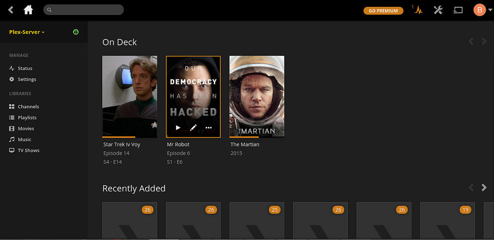

# Raspberry Pi Network Attached Storage (NAS)

Setup a simple NAS for home. There are numerous references around the web (which I linked to for reference), I am just trying to document my setup. A good general reference is:

- [alexellis.io](http://blog.alexellis.io/hardened-raspberry-pi-nas/)

**Still Work in Progress**

- Need to add an external hard drive, I have done this before, but last time the drive died on me because (I think) it *never* spun down. So I want to select a drive that can be modified with something like `hdparam`

## Rasbian

I am using Raspbian Jessie Lite (2017-01-11) as the base. Once setup, do (this took a while for me):

	sudo apt update
	sudo apt upgrade

**Note** I am using the newer package manager `apt` instead of the older ones `apt-get` and `apt-cache`. Now get tools to upgrade the kernel (raspbian always has an old kernel).

	sudo apt install rpi-update
	sudo rpi-update

Now your kernel and software should be good to go.

### Customization

`raspi-config`:

- host name
- resize the your micro SD card
- change the GPU/memory split
- correct time zone
- set local to `en_US.UTF-8 UTF-8` (default is en_GB because rpi was made in the UK)

When you login via `ssh` you get a bunch of licensing garbage. You can change the message of the day (motd) by editing `/etc/motd` to something else ... I like ascii art!

	nina@Dalek ~ $ ssh pi@raspberrypi.local
	pi@raspberrypi.local's password: 

				  a8888b.   
				 d888888b. 
				 8P"YP"Y88 
				 8|o||o|88 
				 8'    .88 
				 8`._.' Y8. 
				d/      `8b. 
			   dP   .    Y8b. 
			  d8:'  "  `::88b 
			 d8"         'Y88b 
			:8P    '      :888 
			 8a.   :     _a88P 
		   ._/"Yaa_:   .| 88P| 
		   \    YP"    `| 8P  `.
		   /     \.___.d|    .' 
		   `--..__)8888P`._.' 
	Last login: Sat Feb 18 20:12:10 2017 from fe80::14f5:a870:7365:b0e1%eth0
	pi@raspberrypi:~ $ 

### Software

Other useful software can be installed with `sudo apt install <package>`:

- build-essential
- cmake
- nmap
- python-dev
- htop

[kernel ref](http://walchko.github.io/posts/2014/10/linux-kernel/)

## Static IP Address

Since this is a server, I don't want the IP address to change. I also use a wired interface, but I also show a wifi example below:

	[kevin@raspberrypi ~]$ more /etc/network/interfaces
	auto lo
	iface lo inet loopback

	# dynamic interface
	#iface eth0 inet dhcp

	# static interface
	iface eth0 inet static
	  address 192.168.1.112
	  netmask 255.255.255.0
	  gateway 192.168.1.1

	auto wlan0
	iface wlan0 inet static
	  address 192.168.1.111
	  wpa-conf /etc/wpa_supplicant/wpa_supplicant.conf
	  netmask 255.255.255.0
	  gateway 192.168.1.1

## Node.js

Node is historically old on debian servers, so let's get updates from the source.

	curl -sL https://deb.nodesource.com/setup_7.x | sudo -E bash -
	sudo apt-get install -y nodejs

This will install it to `/usr/lib` instead of `/usr/local` unfortunately.

[node docs](https://nodejs.org/en/download/package-manager/#debian-and-ubuntu-based-linux-distributions)

### NPM

Other useful npms can be installed with `sudo npm install -g <package>`:

- httpserver
- archeyjs

[node ref](http://walchko.github.io/posts/2015/09/nodejs/)

## Samba

This is the preferred way to communicate between macOS and linux. First let's install the software:

	sudo apt-get update
	sudo apt-get install samba samba-common-bin

Setup a login for user `pi` (or whatever user you want):

	sudo smbpasswd -a pi

Now let's set it up:

	sudo cp /etc/samba/smb.conf /etc/samba/smb.bak
	sudo pico /etc/samba/smb.conf

Change the config file to look like this:

	#======================= Global Settings =======================

	[global]
	   workgroup = WORKGROUP
	   wins support = yes
	   dns proxy = no

	#### Debugging/Accounting ####
	   log file = /var/log/samba/log.%m
	   max log size = 1000
	   syslog = 0
	   panic action = /usr/share/samba/panic-action %d

	####### Authentication #######

	   server role = standalone server
	   passdb backend = tdbsam
	   obey pam restrictions = yes
	   unix password sync = yes
	   passwd program = /usr/bin/passwd %u
	   passwd chat = *Enter\snew\s*\spassword:* %n\n *Retype\snew\s*\spassword:* %n\n *password\supdated\ssuccessfully* .
	   pam password change = yes
	   map to guest = bad user

	############ Misc ############

	# Allow users who've been granted usershare privileges to create
	# public shares, not just authenticated ones
	   usershare allow guests = yes

	#======================= Share Definitions =======================

	[homes]
	   comment = Home Directories
	   browseable = yes
	   read only = no
	   create mask = 0700
	   directory mask = 0700
	   valid users = %S

## Hard Drive

Setting up the USB drive:

- format it for exFat so it is read/write on both Linux and macOS and supports files >4Gib
	- need to install drivers for it: `sudo apt install exfat-fuse`
- copy over any movies (faster than network)
- use a powered hub, the drive I have pulled enough power to brown out the RPi 3

		pi@nas:/home/plex $ sudo mkdir /media/usb
		pi@nas:/home/plex $ sudo chown -R plex:pi /media/usb
		pi@nas:/home/plex $ sudo chown -R pi:pi /media/usb
		pi@nas:/home/plex $ sudo mount /dev/sda2 /media/usb -o uid=pi,gid=pi
		FUSE exfat 1.1.0
		pi@nas:/home/plex $ sudo chmod 777 -R /media/usb/

Notice how the exfat driver popped up when we mounted the hd. Now setup `/etc/fstab`: `UUID=58A8-E5BE /mnt/PIHDD exfat defaults,auto,user,umask=000,rw,uid=pi,gid=pi 0 0`

- **auto** – The filesystem can be mounted automatically (at bootup, or when mount is passed the -a option). This is really unnecessary as this is the default action of mount -a anyway.
- **rw** – Mount read-write.
- **user** – Permit any user to mount the filesystem. This automatically implies noexec, nosuid,nodev unless overridden.
- **defaults** – Use default settings. Equivalent to rw, suid, dev, exec, auto, nouser, async.
- **umaks** - Sets the default permissions for folders and files. It is the opposite of chmod, so to do a chmod 777, you would issue `umask=000`
- **uid/gid** - Set user and group ids

You can get the UUID by:

	pi@nas:~ $ sudo blkid
	/dev/mmcblk0p1: LABEL="boot" UUID="0F5F-3CD8" TYPE="vfat" PARTUUID="05a2e98f-01"
	/dev/mmcblk0p2: UUID="0aed834e-8c8f-412d-a276-a265dc676112" TYPE="ext4" PARTUUID="05a2e98f-02"
	/dev/mmcblk0: PTUUID="05a2e98f" PTTYPE="dos"
	/dev/sdb1: LABEL="EFI" UUID="3F3C-1AF6" TYPE="vfat" PARTLABEL="EFI System Partition" PARTUUID="0d08e539-26cd-409a-a671-60be8792e7e6"
	/dev/sdb2: LABEL="Nixon" UUID="58A8-E5BE" TYPE="exfat" PARTLABEL="Untitled" PARTUUID="1e6665d5-8724-4e7e-8060-ada89b769224"
	/dev/sdb3: UUID="f10a9273-79d0-3c94-8c3a-b1f98e8bf45a" LABEL="Recovery HD" TYPE="hfsplus" PARTLABEL="Recovery HD" PARTUUID="db64ac2d-3a38-4e8d-abba-ca08d0a5fd49"

- [exfat](https://miqu.me/blog/2015/01/14/tip-exfat-hdd-with-raspberry-pi/)
- [mounting hd](http://www.makeuseof.com/tag/how-to-mount-a-usb-flash-device-in-linux-and-your-raspberry-pi/)
- [mounting hd](https://miqu.me/blog/2015/01/14/tip-exfat-hdd-with-raspberry-pi/)
- [fstab ref](http://www.omaroid.com/fstab-permission-masks-explained/)
- [chmod command ref](https://www.maketecheasier.com/file-permissions-what-does-chmod-777-means/)

### HD Sleep

**not working with my current usb drive**

Let's get some info:

	pi@nas:~ $ sudo hdparm -I /dev/sda

	/dev/sda:

	ATA device, with non-removable media
		Model Number:       WDC WD2500BMVS-11F9S0                   
		Serial Number:      WD-WXE808D77224
		Firmware Revision:  01.01A11
		Transport:          Serial, SATA 1.0a, SATA II Extensions, SATA Rev 2.5
	Standards:
		Supported: 8 7 6 5 
		Likely used: 8
	Configuration:
		Logical		max	current
		cylinders	16383	16383
		heads		16	16
		sectors/track	63	63
		--
		CHS current addressable sectors:   16514064
		LBA    user addressable sectors:  268435455
		LBA48  user addressable sectors:  488397168
		Logical/Physical Sector size:           512 bytes
		device size with M = 1024*1024:      238475 MBytes
		device size with M = 1000*1000:      250059 MBytes (250 GB)
		cache/buffer size  = 8192 KBytes
		Nominal Media Rotation Rate: 5400
	Capabilities:
		LBA, IORDY(can be disabled)
		Queue depth: 32
		Standby timer values: spec'd by Standard, with device specific minimum
		R/W multiple sector transfer: Max = 16	Current = 0
		Advanced power management level: 120
		Recommended acoustic management value: 128, current value: 254
		DMA: mdma0 mdma1 mdma2 udma0 udma1 udma2 udma3 udma4 udma5 *udma6 
		     Cycle time: min=120ns recommended=120ns
		PIO: pio0 pio1 pio2 pio3 pio4 
		     Cycle time: no flow control=120ns  IORDY flow control=120ns
	Commands/features:
		Enabled	Supported:
		   *	SMART feature set
			Security Mode feature set
		   *	Power Management feature set
		   *	Write cache
		   *	Look-ahead
		   *	Host Protected Area feature set
		   *	WRITE_BUFFER command
		   *	READ_BUFFER command
		   *	NOP cmd
		   *	DOWNLOAD_MICROCODE
		   *	Advanced Power Management feature set
			SET_MAX security extension
		   *	Automatic Acoustic Management feature set
		   *	48-bit Address feature set
		   *	Device Configuration Overlay feature set
		   *	Mandatory FLUSH_CACHE
		   *	FLUSH_CACHE_EXT
		   *	SMART error logging
		   *	SMART self-test
		   *	General Purpose Logging feature set
		   *	WRITE_{DMA|MULTIPLE}_FUA_EXT
		   *	64-bit World wide name
		   *	IDLE_IMMEDIATE with UNLOAD
		   *	Segmented DOWNLOAD_MICROCODE
		   *	Gen1 signaling speed (1.5Gb/s)
		   *	Native Command Queueing (NCQ)
		   *	Host-initiated interface power management
		   *	Phy event counters
			DMA Setup Auto-Activate optimization
			Device-initiated interface power management
		   *	Software settings preservation
		   *	SMART Command Transport (SCT) feature set
		   *	SCT Read/Write Long (AC1), obsolete
		   *	SCT Write Same (AC2)
		   *	SCT Error Recovery Control (AC3)
		   *	SCT Features Control (AC4)
		   *	SCT Data Tables (AC5)
			unknown 206[12] (vendor specific)
			unknown 206[13] (vendor specific)
	Security: 
		Master password revision code = 65534
			supported
		not	enabled
		not	locked
		not	frozen
		not	expired: security count
			supported: enhanced erase
		92min for SECURITY ERASE UNIT. 92min for ENHANCED SECURITY ERASE UNIT. 
	Logical Unit WWN Device Identifier: 50014ee2acac3640
		NAA		: 5
		IEEE OUI	: 0014ee
		Unique ID	: 2acac3640
	Checksum: correct

For a hard drive to spin down, the APM needs to be below 128:

	pi@nas:~ $ sudo hdparm -B /dev/sd?

	/dev/sda:
	 APM_level	= 120

This drive should spin down. To set the time use the `-S #` switch where # is multiplied by 5 to get the seconds before it spins down. Thus `-S 120` would spin down in 5 x 120 = 600 sec or 10 mins. 

	pi@nas:~ $ sudo hdparm -S 120 /dev/sda

	/dev/sda:
	 setting standby to 120 (10 minutes)
	 HDIO_DRIVE_CMD(setidle) failed: Invalid argument

**mine fails**

- [hdparm](http://www.linux-magazine.com/Online/Features/Tune-Your-Hard-Disk-with-hdparm)
- [hdparm](https://wiki.archlinux.org/index.php/hdparm)
- [hdparam  there looks to be an error in this ref](http://www.htpcguides.com/spin-down-and-manage-hard-drive-power-on-raspberry-pi/)

## Plex.tv

Update software:

	sudo apt update
	sudo apt upgrade
	sudo apt install apt-transport-https

Setup new repo that has `plexserver`:

	wget -O - https://dev2day.de/pms/dev2day-pms.gpg.key  | sudo apt-key add -  
	echo "deb https://dev2day.de/pms/ jessie main" | sudo tee /etc/apt/sources.list.d/pms.list
	
Now get the software:

	sudo apt update
	sudo apt-get install -t jessie plexmediaserver

Fix permissions by `sudo pico /etc/default/plexmediaserver`:

	# default script for Plex Media Server

	# the number of plugins that can run at the same time
	PLEX_MEDIA_SERVER_MAX_PLUGIN_PROCS=6

	# ulimit -s $PLEX_MEDIA_SERVER_MAX_STACK_SIZE
	PLEX_MEDIA_SERVER_MAX_STACK_SIZE=3000

	# where the mediaserver should store the transcodes
	PLEX_MEDIA_SERVER_TMPDIR=/tmp

	# uncomment to set it to something else
	# PLEX_MEDIA_SERVER_APPLICATION_SUPPORT_DIR="${HOME}/Library/Application\ Support"
	PLEX_MEDIA_SERVER_APPLICATION_SUPPORT_DIR="${HOME}/Library/Application_Support"

	# the user that PMS should run as, defaults to 'plex'
	# note that if you change this you might need to move
	# the Application Support directory to not lose your
	# media library
	PLEX_MEDIA_SERVER_USER=pi

This allows plex to run as `pi` and no need to worry about permissions anymore.

The plex server is controlled by: `sudo /etc/init.d/plexmediaserver restart|status|stop|start`

Make sure it works, by launching a browser and connecting to: `raspberrypi.local:32400/web`. If you renamed your server, then change raspberrypi.local with <pi_name>.local.

### Issues

- I tried to add a movie but it wouldn't show up. **Solution:** plex is run from `/etc/init.d` by user `plex` and I put the movie in a place owned by `pi` ... permission!!! Make sure your movies are located where user `plex` has access.

[instructions](https://www.element14.com/community/community/raspberry-pi/raspberrypi_projects/blog/2016/03/11/a-more-powerful-plex-media-server-using-raspberry-pi-3)

## SSH

To ease logins, from macOS, do:

	ssh-copy-id pi@raspberrypi.local

This will copy over your `id_rsa.pub` key so you can authenticate without having to use a password. Now if you are really security minded, you can disable passwords over ssh and **only** allow cryptographic keys to login. My setup doesn't need to be that secure.

# License

## Software

MIT

## Documentation

 This work is licensed under a <a rel="license" href="http://creativecommons.org/licenses/by-sa/4.0/">Creative Commons Attribution-ShareAlike 4.0 International License</a>.
